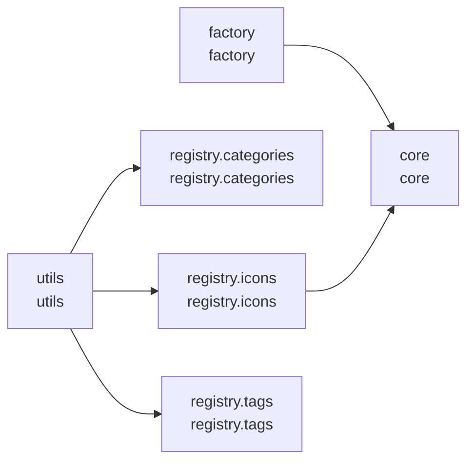

# cjm-fasthtml-lucide-icons


<!-- WARNING: THIS FILE WAS AUTOGENERATED! DO NOT EDIT! -->

## Install

``` bash
pip install cjm_fasthtml_lucide_icons
```

## Project Structure

    nbs/
    ├── registry/ (3)
    │   ├── categories.ipynb  # Auto-generated category index for Lucide icons.
    │   ├── icons.ipynb       # Auto-generated registry of Lucide icon data.
    │   └── tags.ipynb        # Auto-generated tag index for Lucide icons.
    ├── core.ipynb     # Data structures for representing Lucide icon elements and metadata.
    ├── factory.ipynb  # SVG factory function for building FastHTML Lucide icon components.
    └── utils.ipynb    # Discovery utilities for browsing and searching available Lucide icons.

Total: 6 notebooks across 1 directory

## Module Dependencies



*5 cross-module dependencies detected*

## CLI Reference

No CLI commands found in this project.

## Module Overview

Detailed documentation for each module in the project:

### registry.categories (`categories.ipynb`)

> Auto-generated category index for Lucide icons.

#### Import

``` python
from cjm_fasthtml_lucide_icons.registry.categories import (
    CATEGORIES
)
```

#### Variables

``` python
CATEGORIES: Dict[str, List[str]]
```

### core (`core.ipynb`)

> Data structures for representing Lucide icon elements and metadata.

#### Import

``` python
from cjm_fasthtml_lucide_icons.core import (
    SvgElement,
    PathElement,
    CircleElement,
    RectElement,
    LineElement,
    EllipseElement,
    PolylineElement,
    PolygonElement,
    IconData
)
```

#### Classes

``` python
@dataclass
class PathElement:
    "SVG path element data."
    
    d: str  # path data string
```

``` python
@dataclass
class CircleElement:
    "SVG circle element data."
    
    cx: str  # center x coordinate
    cy: str  # center y coordinate
    r: str  # radius
```

``` python
@dataclass
class RectElement:
    "SVG rect element data."
    
    x: str  # x position
    y: str  # y position
    width: str  # width
    height: str  # height
    rx: Optional[str]  # corner radius (optional)
```

``` python
@dataclass
class LineElement:
    "SVG line element data."
    
    x1: str  # start x
    y1: str  # start y
    x2: str  # end x
    y2: str  # end y
```

``` python
@dataclass
class EllipseElement:
    "SVG ellipse element data."
    
    cx: str  # center x coordinate
    cy: str  # center y coordinate
    rx: str  # x radius
    ry: str  # y radius
```

``` python
@dataclass
class PolylineElement:
    "SVG polyline element data."
    
    points: str  # space-separated coordinate pairs
```

``` python
@dataclass
class PolygonElement:
    "SVG polygon element data."
    
    points: str  # space-separated coordinate pairs
```

``` python
@dataclass
class IconData:
    "Container for a Lucide icon's SVG elements and metadata."
    
    elements: List[SvgElement]  # SVG child elements
    categories: List[str] = field(...)  # category assignments
    tags: List[str] = field(...)  # searchable tags
```

### factory (`factory.ipynb`)

> SVG factory function for building FastHTML Lucide icon components.

#### Import

``` python
from cjm_fasthtml_lucide_icons.factory import (
    lucide_icon
)
```

#### Functions

``` python
def _build_element(
    element: SvgElement  # element dataclass to convert
):  # FastHTML SVG element component
    "Convert an element dataclass to a FastHTML SVG component."
```

``` python
def _build_svg(
    icon_data: IconData,  # icon data containing SVG elements
    size: int = 5,        # Tailwind size scale (default 5 = 20px)
    cls: str = None,      # additional CSS classes
    **kwargs              # additional SVG attributes
) -> Svg:  # FastHTML Svg component
    "Build a FastHTML Svg component from IconData."
```

``` python
def lucide_icon(
    name: str,        # icon name (e.g., "folder", "arrow-up")
    size: int = 5,    # Tailwind size scale (default 5 = 20px)
    cls: str = None,  # additional CSS classes (e.g., daisyUI colors)
    **kwargs          # additional SVG attributes
) -> Svg:  # FastHTML Svg component
    "Get a Lucide icon as a FastHTML Svg component."
```

### registry.icons (`icons.ipynb`)

> Auto-generated registry of Lucide icon data.

#### Import

``` python
from cjm_fasthtml_lucide_icons.registry.icons import (
    ICONS
)
```

#### Variables

``` python
ICONS: Dict[str, IconData]
```

### registry.tags (`tags.ipynb`)

> Auto-generated tag index for Lucide icons.

#### Import

``` python
from cjm_fasthtml_lucide_icons.registry.tags import (
    TAGS
)
```

#### Variables

``` python
TAGS: Dict[str, List[str]]
```

### utils (`utils.ipynb`)

> Discovery utilities for browsing and searching available Lucide icons.

#### Import

``` python
from cjm_fasthtml_lucide_icons.utils import (
    list_icons,
    icon_count,
    get_categories,
    category_count,
    search_icons,
    get_tags,
    tag_count,
    get_icon_categories,
    get_icon_tags
)
```

#### Functions

``` python
def list_icons(
    category: Optional[str] = None  # filter by category name (optional)
) -> List[str]:  # sorted list of icon names
    "List available icon names, optionally filtered by category."
```

``` python
def icon_count(
    category: Optional[str] = None  # filter by category name (optional)
) -> int:  # number of icons
    "Get the count of available icons, optionally filtered by category."
```

``` python
def get_categories() -> List[str]:  # sorted list of category names
    "List all available category names."
```

``` python
def category_count() -> int:  # number of categories
    "Get the count of available categories."
```

``` python
def search_icons(
    tag: str  # tag to search for
) -> List[str]:  # sorted list of icon names with that tag
    "Search for icons by tag."
```

``` python
def get_tags() -> List[str]:  # sorted list of all tags
    "List all available tags."
```

``` python
def tag_count() -> int:  # number of tags
    "Get the count of available tags."
```

``` python
def get_icon_categories(
    name: str  # icon name
) -> List[str]:  # categories the icon belongs to
    "Get the categories an icon belongs to."
```

``` python
def get_icon_tags(
    name: str  # icon name
) -> List[str]:  # tags assigned to the icon
    "Get the tags assigned to an icon."
```
